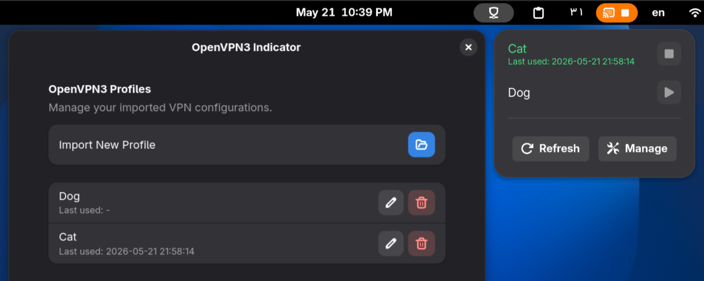

#  OpenVPN3 Indicator

A GNOME Shell extension to control OpenVPN 3 Linux client sessions and configurations directly from the top panel.

## Features

- Manage OpenVPN 3 Linux client sessions.
- Start, stop, and monitor active VPN connections.

## Requirements

- GNOME Shell (45, 46, 47, 48, 49, 50)
- `openvpn3` Linux client installed on your system

## Installation

### From Extensions.gnome.org

(If published) Visit the GNOME Extensions website and search for "OpenVPN3 Indicator".

### From Source

Clone this repository and run the installation command:

```bash
git clone <repository-url>
cd openvpn3-indicator
make install
```

*Note: You may need to log out and log back in, or restart GNOME Shell (on X11) to apply changes.*

## Development

This repository provides a `Makefile` to simplify development tasks:

- `make install` - Installs the extension to your local GNOME extensions directory.
- `make devkit` - Starts a nested GNOME Shell instance for testing.
- `make debug` - Installs the extension, enables it, and tails the system journal for logs.
- `make schemas` - Compiles the glib schemas.
- `make gen-translations` - Extracts strings and compiles translations (`.po` to `.mo`).
- `make bump-version` - Bumps the version number in `metadata.json`.
- `make pack` - Packages the extension into a `.zip` file for release.
- `make release` - Bumps the version and creates a `.zip` package.

## License

This project is licensed under the [MIT License](LICENSE).
